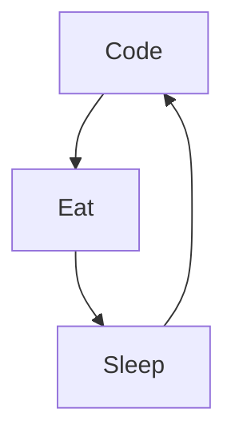

# Hi, I'm Antoine Cuinet !

I'm Antoine from France, living in Besançon, I'm a computer science student, passionate about web development, I do Freelancing.

Actually :

- 🔭 I’m currently working on a new [Online Course][courses] ...
- 🌱 I’m currently learning amazing things ...
- 👯 I help people to be programmers and freelancers ...
- ⚡ Fun fact : I'am DJ, Diver, Skateboarder and Surfer
- 📫 How to reach me: Instagram or email
- 🔭 I’m currently working on ...
- 🌱 I’m currently learning ...
- 👯 I’m looking to collaborate on ...
- 🤔 I’m looking for help with ...
- 💬 Ask me about ...
- 📫 How to reach me: ...
- 😄 Pronouns: ...
- ⚡ Fun fact: ...

### Connect with me :

&nbsp;&nbsp;

### Languages and Tools :

  

### My daily routine :

### GitHub Stats :

### Recent GitHub Activity :
<!--START_SECTION:activity-->

<!--END_SECTION:activity-->

[website]: https://acuinet.fr/
[linkedin]: https://www.linkedin.com/in/antoine-cuinet/
<!--  -->